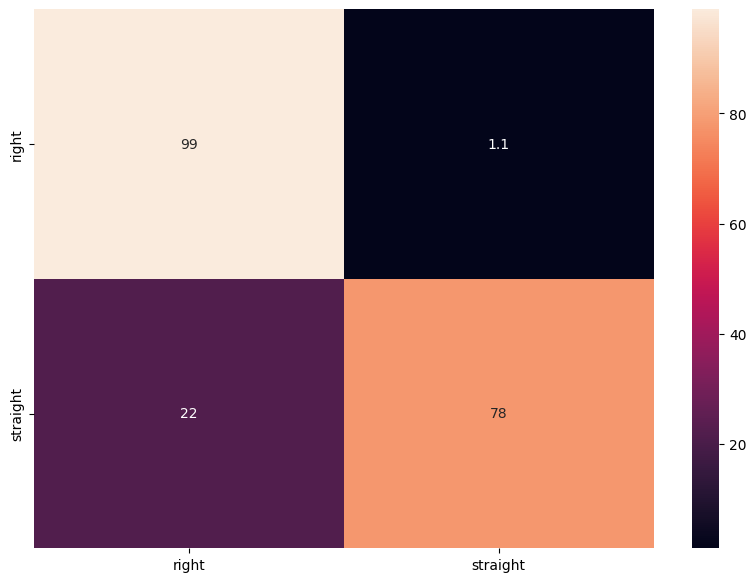
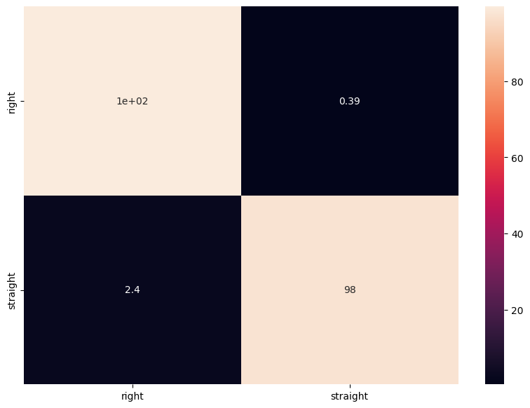

# 自動走行AIラジコンカー (AI-Powered Self-Driving RC Car)

## デモ動画
#### [1周verのデモ動画はこちらから](https://youtube.com/shorts/16H95x0K_Tw?feature=share)

#### [3周verのデモ動画はこちらから](https://youtube.com/shorts/wJ3uO23QkwY)

## 概要 (Overview)
本プロジェクトは、AIモデルを用いたラジコンカーのコース内自動走行を目指すものです。１年後期から、２年前期にかけての一年間の授業を通じ、先生からご提供いただいた機体やGoogle Colabのコード、制御プログラムを基盤としながら、３人のチームでAIモデルの改良や機体の物理的な調整を重ねました。 1年生の時にモデル作成までで断念した経験をバネに、今回はコースの白線を越えることなく、安定して複数周走行する自動走行を完成させることができました。

## 構成 (Architecture)
### ハードウェア (Hardware)

・制御ユニット: Raspberry Pi 4 Model B 

・車体: PiCar-4wd 

・その他: モータードライバー等を含むHAT , Webカメラ 

### ソフトウェア & API (Software & API)

・機械学習フレームワーク: TensorFlow 

・車両制御API: SunFounder PiCar-4WD API

## 主な機能と工夫 (Features & Improvements)

モデルの精度と走行性能を向上させるため、ソフトウェアとハードウェアの両面から以下の工夫を行いました。

#### ・ 処理の単純化: 

走行判断を「直進(Straight)」と「右折(Right)」のみに絞り、左折の選択肢を無くすことでRaspberry Piの処理負荷を軽減しました 。

#### ・モーター出力の最適化:

よりスムーズに旋回できるよう、モーターの値を細かく調整しました 。

#### ・物理バランスの調整: 

モバイルバッテリーを車体前方に配置することで前輪に荷重をかけ、カーブ時のタイヤの空回りを防ぎ、旋回性能を向上させました 。

#### データ収集の効率化:

カメラの高さを常に一定に保ち、一貫性のある画像を収集しました 。

コース全体を周回するのではなく、モデルの学習に特に重要となるカーブなどに絞ってデータを収集しました 。

## データセット戦略とモデル性能 (Dataset Strategy & Performance)

#### データセット構築方針

本プロジェクトの成功は、データセットの品質にありました。特に「Straight」と「Right」の判断基準を明確に定義し、それに合致しない画像を徹底的に排除する方針を取りました。

・Straightの判断基準: 黄色い線がまっすぐ見え、カーブが遠くにある画像を対象としました 。

・Rightの判断基準: カーブの中腹を捉えた画像や、コースアウトを防ぐためにあえて黄色い線が映っていない画像もデータセットに含めました 。

・削除した画像の例: カーブ手前の画像は、以前は「Straight」と判断していましたが、これがカーブ走行中の誤認識の原因となっていたため、データセットから意図的に削除しました 。

#### モデル性能の比較
##### <改善前>

##### <改善後>

## 使い方 (Usage)
### 1,基本的な実行手順 (Basic Usage)
#### (1)モデルの配置

学習済みのAIモデル (converted_model.tflite) を、Raspberry Pi上でプログラム (auto.py など) と同じディレクトリに配置します。

#### (2)自動走行の開始

Raspberry Pi上で以下のコマンドを実行すると、自動走行が開始します

python auto.py

### 2.モデルを改善する開発サイクル (for Developers)
#### (1)走行テストと画像収集

上記の手順で自動走行させます。走行中にカメラが捉えた画像は、指定されたディレクトリに自動で保存されます。

#### (2)データセットの強化

保存された画像を1枚ずつ確認し、「直進」「右折」の判断が適切だったかを見直します。モデルが誤認識した画像などを、それぞれ正しいデータセット用のフォルダに移動させます。

#### (3)モデルの再学習

強化したデータセットを使い、PCなどの学習環境で再度モデルを学習させ、新しいconverted_model.tflite を生成します 。

#### (4)モデルの更新と評価

新しく生成した converted_model.tflite をRaspberry Piに転送して古いモデルを上書きし、再度ステップ1に戻って改善されたモデルの走行性能を評価します。

## プロジェクトの学びと今後の展望 (Learnings & Future Outlook)

### 学び (Learnings)

・画像収集からモデル生成、実機での自動走行までの一連の開発プロセスを深く理解できました 。

・プロジェクトを通して発生した技術的なトラブルに対し、チームで解決策の選択肢を出し合い、どのようにアプローチすればよいかを実践的に学ぶことができました 。

・プロジェクト中盤で精度が上がらずチームにフラストレーションが溜まった際も、スケジュール管理や進捗の可視化を行うことで、困難を乗り越える経験ができました。

・画像の収集、選別、テストというサイクルは地道な作業であり、精度だけでないプロジェクト遂行の難しさとやりがいを学びました。

## 課題 (Issues)

・機器の扱いや効率的な画像収集方法に慣れていなかったため、当初は多くの時間を要し、実際の目標だった拡張機能の実装まで至りませんでした 。

・期間の前半ではチーム内での役割分担があまりうまくできずに、時間をかけすぎてしまった。

## 今後の展望 (Future Work)
今回の開発を通して、チームでの役割分担、機器のセットアップやトラブルシューティングといった、技術的な実装以外の課題にも直面しました。これらの課題に地道に取り組む中で、効率的なタスク管理の重要性や、ハードウェア関連のエラーを粘り強く解決する忍耐力を身につけることができました。

本プロジェクトで得たデータ収集からモデル実装、実機テストまでの一連の経験を活かし、今後はAIを活用したアプリケーションを企画から開発まで独力で完成させることを次の目標とします。

### 謝辞:
本プロジェクトを進めるにあたり、ご指導いただいた教授、サポートしてくださったTA、そして共に課題を乗り越えたチームメンバーに心から感謝します。
